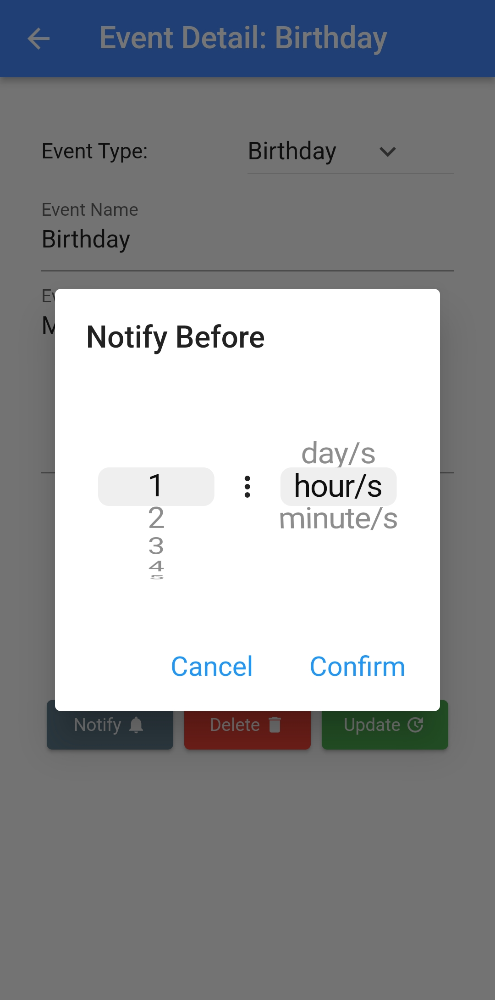
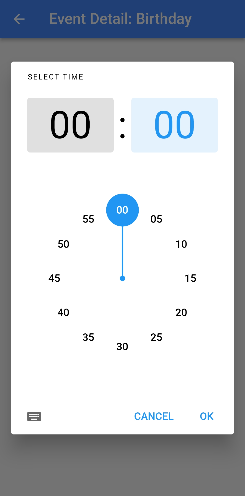

# Event Calendar

### An event calendar flutter mobile application project.

A simple app used to track important events. The timer for each event starts when the event is created. Users can create, edit and delete events. If an event is over user is notified and event card becomes red. Users can choose when to be notified prior to the event. Users can search and access their events via the search bar.

